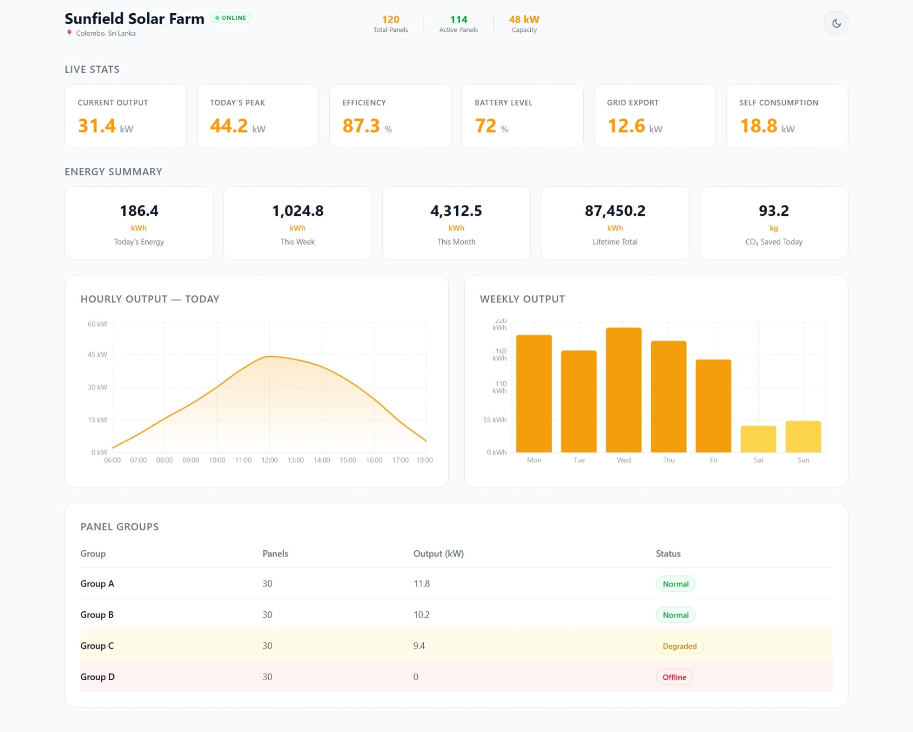
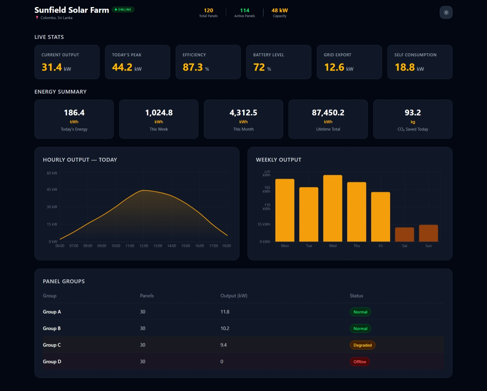

# Sunfield Solar Farm — Monitoring Dashboard

A read-only solar power monitoring dashboard built with React, Tailwind CSS v4, and Recharts. Displays live stats, energy summaries, hourly and weekly output charts, and panel group health for a 48 kW solar installation in Colombo, Sri Lanka.

---

## Screenshots

### Light Mode


### Dark Mode


---

## Features

- **Sticky glassmorphism header** — collapses on scroll with backdrop blur, smooth transitions, and a dark/light mode toggle
- **Live Stats cards** — current output, today's peak, efficiency, battery level, grid export, and self consumption
- **Energy Summary tiles** — today, this week, this month, lifetime total, and CO₂ saved
- **Hourly Output chart** — area chart showing kW output from 06:00–18:00 (Recharts)
- **Weekly Output chart** — bar chart showing kWh per day with visual callout for low-output days
- **Panel Groups table** — per-group status with colour-coded row highlights (Normal / Degraded / Offline)
- **Dark / Light theme** — managed via React Context API, persisted to the `<html>` element
- **Fully responsive** — desktop, tablet, and mobile layouts via Tailwind breakpoints
- **No backend** — all data is hardcoded in `src/data/solarData.js`

---

## Tech Stack

| Tool | Version | Purpose |
|---|---|---|
| React | 19 | UI framework |
| Vite | 8 | Build tool and dev server |
| Tailwind CSS | v4 | Utility-first styling |
| Recharts | 3 | Chart components |

---

## Project Structure

```
src/
├── data/
│   └── solarData.js          # All hardcoded site data
├── context/
│   └── ThemeContext.jsx       # Dark/light theme via Context API
├── components/
│   ├── SiteHeader.jsx         # Sticky header with scroll behaviour
│   ├── StatCard.jsx           # Reusable live-stat card
│   ├── LiveMetrics.jsx        # Grid of 6 StatCards
│   ├── EnergySummary.jsx      # Row of 5 energy summary tiles
│   ├── HourlyChart.jsx        # Recharts AreaChart — hourly kW output
│   ├── WeeklyChart.jsx        # Recharts BarChart — daily kWh for the week
│   └── PanelGroupTable.jsx    # Panel group status table
├── App.jsx                    # Root layout — imports data, composes sections
├── main.jsx                   # React entry point, wraps app in ThemeProvider
└── index.css                  # Tailwind v4 import + dark variant config
```

---

## Getting Started

### Prerequisites

- [Node.js](https://nodejs.org/) v18 or higher
- npm v9 or higher

### Installation

```bash
# 1. Clone the repository
git clone <your-repo-url>
cd solar-dashboard

# 2. Install dependencies
npm install
```

### Running the development server

```bash
npm run dev
```

Open [http://localhost:5173](http://localhost:5173) in your browser. The page hot-reloads on every file save.

### Building for production

```bash
npm run build
```

Output goes to the `dist/` folder.

### Previewing the production build locally

```bash
npm run preview
```

---

## Available Scripts

| Script | Description |
|---|---|
| `npm run dev` | Start the Vite dev server with HMR |
| `npm run build` | Build optimised production bundle to `dist/` |
| `npm run preview` | Serve the production build locally |
| `npm run lint` | Run ESLint across the project |

---

## Data

All data is hardcoded in `src/data/solarData.js`. No API calls or backend are involved. To simulate a different site, edit the exported constants directly:

```js
export const siteInfo = { ... };
export const liveStats = { ... };
export const energySummary = { ... };
export const hourlyToday = [ ... ];
export const weeklyData = [ ... ];
export const panelGroups = [ ... ];
```

---

## Design Decisions

- **Context API for theming** — `ThemeContext` holds a single `isDark` boolean and a `toggleTheme` function. The `useEffect` writes/removes the `dark` class on `<html>`, which activates all `dark:` Tailwind variants globally. Chart components use `useTheme()` directly because Recharts renders SVG — CSS classes cannot reach SVG `stroke`/`fill` attributes, so colours are passed as JS props.

- **Sticky header layout** — uses CSS Grid (`grid-cols-[1fr_auto_1fr]`) on desktop so the stats section stays mathematically centred between the title and toggle regardless of content width. On mobile it falls back to `flex justify-between`.

- **Ad-blocker safe filenames** — the live stats component is named `LiveMetrics.jsx` (not `LiveStats.jsx`) to avoid false-positive blocking by browser extensions that match `/stats` in script URLs.
